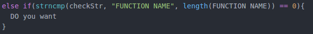

# Overview

This code has three part. Server part, Client part, MARS part.  Server can use MARS program on multiple boards. Network protocol used TCP. Int the board, communication between client and MARS used shared memory(IPC).

# compiling

There is a Makefile. 

- Generate Server
  - `make server`

- Generate Client
  - `make client`
- Generate MARS(Test)
  - `make mars`
- Generate Client and MARS(Test)
  - `make board`
- Generate All files
  - `make all`

If you setup in board, please type `make board`. Then they'll make client and mars program.

# How to use

### 1. Start server

Execute `make server` to make a server program

Execute `./server`

If you see this screen, then It is ready to use client program on other board. 

### 2. Start client

If the server is open, you can use client program.

Execute `make board` to make client program and MARS(Test) program

Execute `./client`

Insert server IP and specific key value(you want) 

### 3. Communication

We are ready to communicate between server and client

###### server -> client

Write a socket number which you want to send. And write a message.

###### client -> server

Just write a message

### 4. Function

###### server

- print - Show sockets that are currently connected.
- stop - Disconnect connection wit the specific client. (A socket number must be entered first)
- quit - Shut down the server and disconnect all connected sockets. If you want to terminate server program, you MUST execute this function.
- check - Check condition(power, frequency..) on the specific board. (A socket number must be entered first)

###### client

- exit - Disconnect connection with the server.

# structure

# If you want to add functions..

Server and client Source has each ServerFunction() and ClientFunction(). That function includes many functions. So if you want to add function, you just follow this format.

